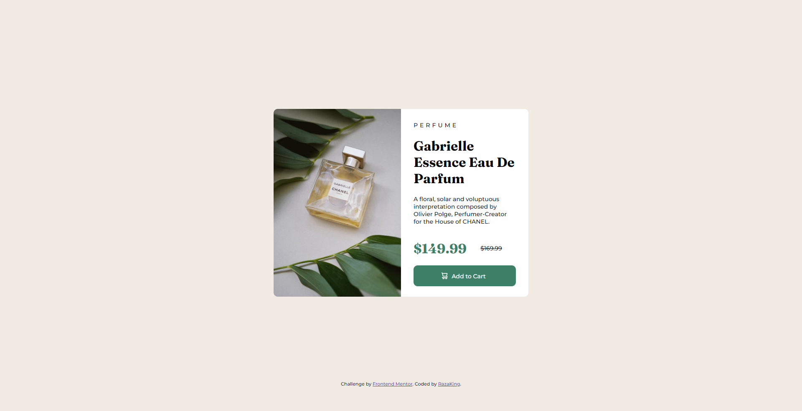

# Frontend Mentor - Product preview card component solution

This is a solution to the [Product preview card component challenge on Frontend Mentor](https://www.frontendmentor.io/challenges/product-preview-card-component-GO7UmttRfa). Frontend Mentor challenges help you improve your coding skills by building realistic projects. 

## Table of contents

- [Overview](#overview)
  - [The challenge](#the-challenge)
  - [Screenshot](#screenshot)
  - [Links](#links)
  - [Built with](#built-with)
  - [What I learned](#what-i-learned)
  

### Screenshot

### Links

- Solution URL: [Add solution URL here](https://your-solution-url.com)
- Live Site URL: [Add live site URL here](https://your-live-site-url.com)

### Built with

 - HTML5 
 - CSS 

### What I learned
I Learnt more about Positioning and Centering a div during this project

## Author

- Website - [ADELEYE ABDULRAZAQ](https://www.your-site.com)
- Frontend Mentor - [@RazaKing](https://www.frontendmentor.io/profile/yourusername)
- Twitter - [@razaqotr](https://www.twitter.com/razaqotr)

